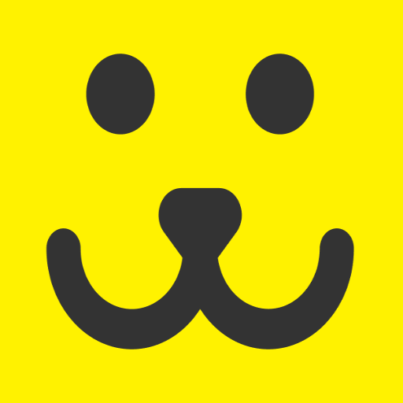
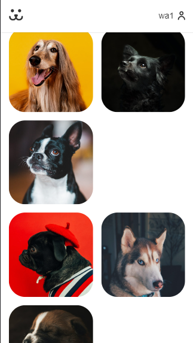
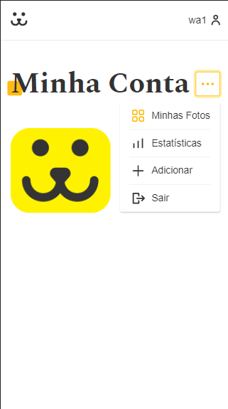
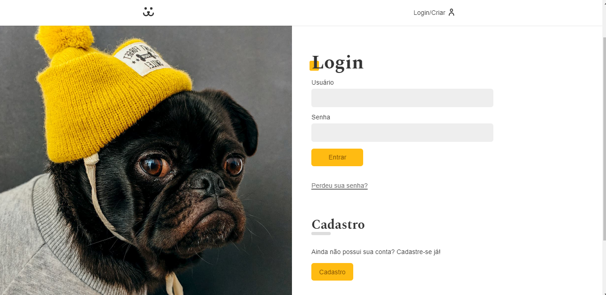
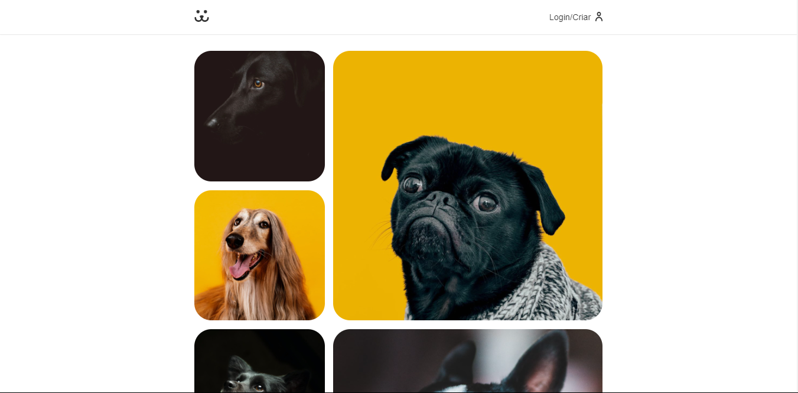
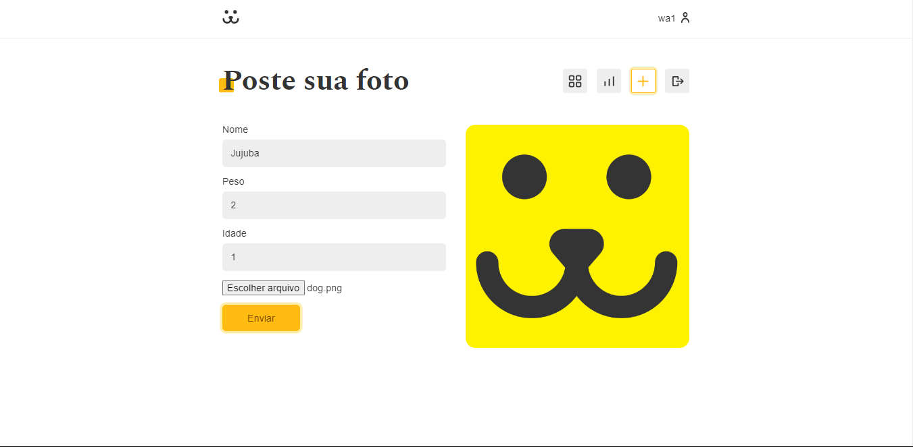

    
    
    
    

#

<h1>Dogs    
</h1>

## Descrição

https://dogs-weld.vercel.app

#### Criação da aplicação Dogs, uma rede social para cachorros criada no curso de React da Origamid.

#

## Layout mobile
 

## Layout web
  

 

# Tecnologias

<ul>
    <li style="list-style: none;">
    <a href="https://create-react-app.dev/" target="_blank">React</a></li>
    <li style="list-style: none;">
    <a href="https://reactrouter.com/" target="_blank">React Router</a></li>
    <li style="list-style: none;">
    <a href="https://github.com/FormidableLabs/victory" target="_blank">Victory</a></li>
</ul>

 

# ℹ️ Como usar

    Clone esse repositório
    $ git clone https://github.com/renovatt/dogs.git

    Instalar dependências
    $ npm install

    Inicie o projeto
    $ npm start

 

# Como contribuir?

#### Você pode dar suporte me seguindo aqui no GitHub, dando uma estrela no projeto ou criar uma conexão comigo no linkedin, fazendo parte da minha Networking e curtir o meu projeto.

 

# Autor

### Criado por <a href="https://www.linkedin.com/in/renovatt/" target="_blank">*Wildemberg Renovato de Lima*</a>